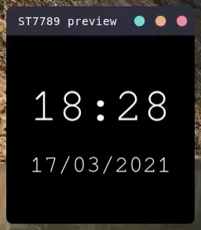

# tkst

[](https://pypi.python.org/pypi/tkst)
[](https://pypi.python.org/pypi/tkst)

## About
Preview projects using the ST7789 spi display (and [corresponding python library](https://github.com/pimoroni/st7789-python)) on your desktop with tkinter.



_an example of [clock.py](https://github.com/mmmsoup/tkst/blob/main/examples/clock.py) on a tkinter display_

## Installation
tkst is available on the python package index, so simply run
```
pip install tkst
```

## Usage
usage information is detailed in the [pypi package's readme](tkst/README.md)